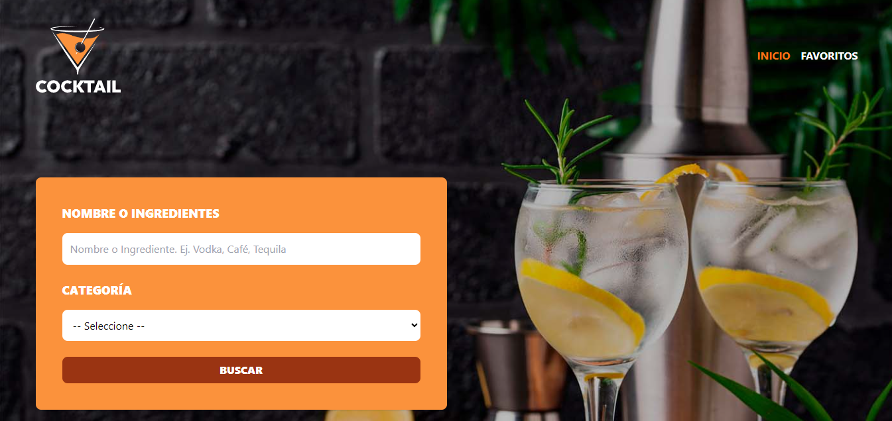

# Buscar receta

App que consiste en la búsqueda la receta de una bebida,
dando como resultado una ventana modal en que aparece el 
producto elegido con la opción de añadirlo a Favoritos, del cual
también puedes eliminarlo.

## React Router

En este proyecto se introducirá React Router.

### ¿Qué es?

 Es una librería muy cómun en REACT con múltiples páginas 

Es de los creadores de Remix Run. 
En las últimas versiones es prácticamente un framework de React. 

### Características

<ul>
  <li>Permitirá crear secciones con diferentes urls tales como /tienda, etc.</li>
  <li>En versiones recientes agregaron la posibilidad de consultar API's y 
procesar formularios.</li>
</ul>

### Instalar

Cliquea <a href="https://www.npmjs.com/package/react-router-dom">aquí</a>.

### NavLink o Link

La única diferencia es que NavLink tiene un acceso a un callback en el classname, útil para resaltar, por ejemplo, la página donde se encuentra el usuario. 

### Hook: useLocation

Este hook nos devuelve el objeto `location`. Dentro de este objeto hay información sobre la URL actual. Esta información se guarda en el `pathname`.

## TailwindCSS. Theming

Nuevo concepto: theming

En la sección de `theme` del archivo `tailwind.config.js` es donde puedes definir la paleta de colores, escalas, fuentes, breakpoints, y más. 

En este proyecto se utiliza para añadir imágenes de fondo. 

## ZUSTAND

### Múltiples stores

Son útiles conforme las apps van creciendo o son más complejas. 

Existen dos formas de manejar múltiples stores:

<ul>
  <li>Crear diferentes stores.</li>
  <li>Slice Pattern.</li>
</ul>

En este proyecto se utilizará `Slice Pattern`.

#### ¿Qué es Slice Pattern?
Es una forma de dividir tus stores en pequeñas piezas y unirlas en un store principal (`useAppStore`)

También se utiliza en Redux Toolkit.

#### Tener en cuenta en este proyecto: 

<ol>
  <li>set -> permite escribir en el state. </li>
  <li>...a -> copia de todos los argumentos (set, get)</li>
</ol>

## API
Para acceder a la api 
cliquea <a href="https://www.thecocktaildb.com/api.php">aquí</a>.

## Headless UI 

Utilizada para la ventana modal.

Click <a href="https://headlessui.com/react/dialog">aquí</a>.